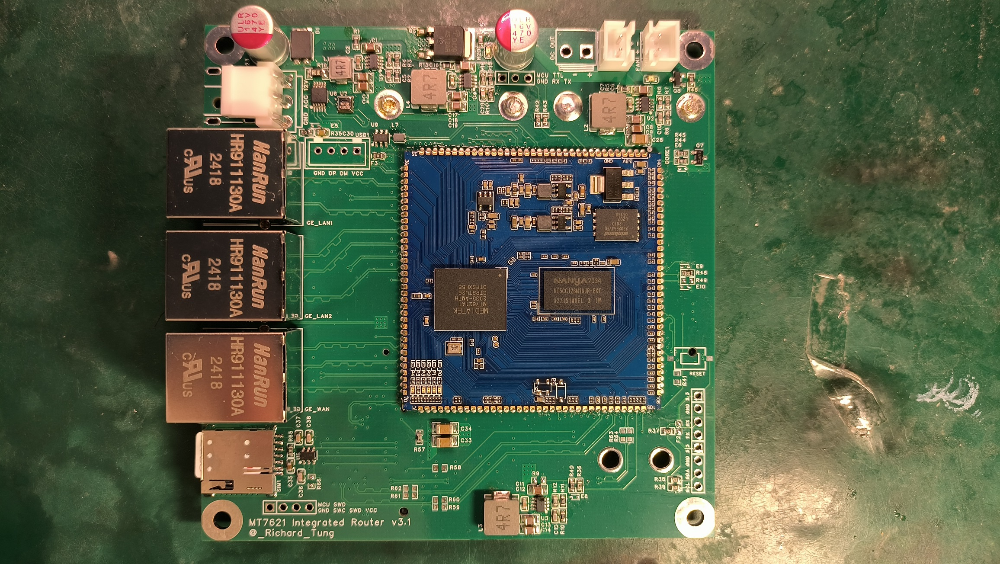

# MT7621车载路由器

---

## 特性

兼容9-15V输入

可调低压保护(由GD32 MCU提供 可由路由器ttyS1连接设置参数 波特率115200)

提供2个带低压保护的输出电源接口 带独立保险丝

支持2块MINI PCI-E无线网卡

支持3042/3052 4G/5G网卡

千兆LAN/WAN

---

## 开源协议:

GPL 3.0

---

## 项目地址:

##### 硬件:

[立创开源硬件平台](http://oshwhub.com/richard.tung/car_integrated_router)

##### 软件:

[GitHub](https://github.com/Richard-Tung/mt7621_integrated_router)

[MCU电源管理 GitHub](https://github.com/Richard-Tung/GD32_IGRouter_PWRMGT)

##### 扩展项目:

###### DIY车载哨兵监控:

[BiliBili](https://www.bilibili.com/video/BV1fVoTYiEk7/)

[小红书](http://xhslink.com/a/82JiEn8iPFsab)

---

## 提供如下接口:

2x MINI PCI-E:    PCIe x1信号 用于WiFi扩展 预留5V供电输入可用于带PA的网卡

1x NGFF B KEY:    PCIe x1+USB3.0信号(PCIe默认不启用) 兼容3042/3052 用于4G/5G网卡扩展

1x NANO SIM:    4G/5G网卡的SIM卡 支持热插拔

1x USB 2.0排针:    可连接任意USB设备

1x GE WAN:    有线WAN口

2x GE LAN:    有线LAN口

1x 5V FAN: 5V风扇接口

1x XH2.54+1x VH3.96:    带低压保护的输出接口(用于其他外设从电池取电)

---

## 配置如下传感器(I2C总线):

INA226:        电压和功率传感器 地址0x40

AHT20:        温度湿度传感器 地址0x38

注意: openwrt下需要安装对应kmod才能使用lm-sensors检测出来

---

## ACC触发检测和低压保护:

支持ACC触发检测

使用BTN_0的按键检测 ACC触发(启动)状态为按下 停车状态为未按下

支持低压保护有序关机

使用power的按键检测 当检测到低压持续10s后触发关机(可调)

---

## 指示灯:

网口上橙色灯为系统下可配置的状态灯

orange:wan

orange:lan1

orange:lan2

其中 

orange:wan 默认为系统状态灯

orange:lan1 默认为WLAN0状态灯

orange:lan2 默认为WLAN1状态灯

---

## 目录结构:

###### 3d_model:

用于安装在车上的外壳3D模型

##### datasheet:

部分原件datasheet

##### dts:

openwrt使用的dts

根据版本将文件放入target/linux/ramips/dts下覆盖

##### lceda_project:

立创EDA的PCB工程文件

##### scripts:

OpenWRT下的脚本文件

rc.button内文件请放入/etc/rc.button

##### router_binary:

预编译的路由器固件

---

## 编译:

目前仅兼容openwrt-24.10

将dts目录里的patch文件在openwrt根目录下应用(git am)

Target System 选择 MediaTek Ralink MIPS

Subtarget 选择 MT7621 based boards

Target Profile 选择 Richard MT7621 Integrated Router

选择自己需要的软件包

进行编译

---

## 固件烧录:

在[MCU电源管理 GitHub](https://github.com/Richard-Tung/GD32_IGRouter_PWRMGT)里下载MCU固件 使用MCU SWD接口进行烧录

按住MCU Reset按键上电 MCU LED会闪烁5次后常亮

使用预编译固件或者自己编译的固件进行升级

**路由器第一次升级时需要强制升级(提示硬件不匹配是正常的) 升级时不要保留数据!**

**第一次升级请务必按住MCU Reset上电 确保MCU LED闪烁5次后常亮 再进行刷机 否则可能会因为看门狗强制重启造成固件损坏**
